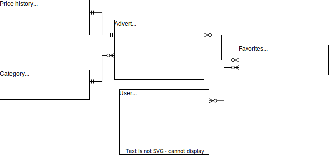

# Проект по курсу Базы данных ФПМИ
## Тема: Сервис хранения информации об объявлениях.  
Моделирование базы данных для сайта объявлений (e.g. Авито, Юла).

В данном проекте я моделирую сервис хранения информации об объявлениях. Основную логику я попыталась приблизить к сервисам объявлений вроде Авито или Юлы.
Основные сущности -- пользователь и объявления. Далее я ввожу категории, историю изменения цен и избранные объявления для поддержания различного типа связей и функционала. 

Основная логика базы данных будет завязана на триггерах, а именно на них будет поддерживаться сохранение истории цены. Категории нужны для потенциального теггирования объявлений, что может привести к упорядоченности в случае масштабирования. Личные данные клиентов я выбирала исходя из возможности подключения двухфактерной аутентификации и чатов (номер телефона) и возможности оплаты (номер карты).  

Логика сохранения ссылочной целостности будет реализованна на механизме триггеров.

**Таблица Пользователей**  
В качестве уникального ключа пользователей я выбрала айди, напрямую связанный с таблицей избранных объявлений.
**Таблица Объявлений**  
ID -- уникальный ключ, с ним связаны избранные объявления и история цены. Так же важнейшим признаком был взят раздел категории, к которому принадлежит объявление, поэтому мы связываемся с таблицей категорий по внешнему ключу.

## Запуск  
Сервер с базой данных находится в Docker-контейнере, из которого выставлен порт 5050. Вся конфигурацию прописана в
Dockerfile-compose файле. Из директории с файлом:  
Запуск: ``docker-compose up ``  
Подключение к контейнеру: ``напишу позже``  
Завершение работы: `` docker-compose down ``
## Концептуальная модель

## Логическая модель

## Физическая модель
#### Users
| Field name | Description | Data type | Restrictions |
|---|---|---|---| 
| user_id | user`s ID | SERIAL | NOT NULL UNIQUE PRIMARY KEY |
| user_nm |  user`s name | VARCHAR(20) | NOT NULL |
| user_last_nm | user`s lastname | VARCHAR(20) | NOT NULL |
| user_birth_dt | user`s lastname | DATE | |
| mobile_phone_no | user`s phone number | INTEGER | UNIQUE |
| email_no | user`s email address |  VARCHAR(40) | UNIQUE |
| card_no | user`s card number |  VARCHAR(40) | |

#### Adverts
| Field name | Description | Data type | Restrictions |
|---|---|---|---| 
| advert_id | advert`s ID | SERIAL | NOT NULL UNIQUE PRIMARY KEY |
| advert_title | title | VARCHAR(20) | NOT NULL |
| advert_desc | description  | VARCHAR(350) | NOT NULL |
| category_id | ID Category of the advert  | VARCHAR(20) | NOT NULL |
| advert_dt | date of creation | DATE |  |
| author_id | ID of the author | INTEGER | |

#### Categories
| Field name | Description | Data type | Restrictions |
|---|---|---|---| 
| category_id | category`s ID | INTEGER | NOT NULL |
| category_title | title | VARCHAR(20) | NOT NULL |

#### Favorites
| Field name | Description | Data type | Restrictions |
|---|---|---|---| 
| advert_id | advert`s ID | INTEGER | NOT NULL |
| user_id | user`s ID | INTEGER | NOT NULL  |

#### Advert_price_history
| Field name | Description | Data type | Restrictions |
|---|---|---|---| 
| advert_id | advert`s ID | INTEGER | NOT NULL |
| price_amt | advert`s price | INTEGER | NOT NULL |
| сhange_price_dt | price setting day | DATE | NOT NULL |

## Выполнение технического задания по проекту

1. См 
2. См
3. Папка DDL_scripts
4. Файлы вида Fill*.sql
5. Файлы вида 10*.sql
6. Файл RequestHard.sql
7. MakeIndexes
8. Представления
9. Процедуры
10. Триггеры
